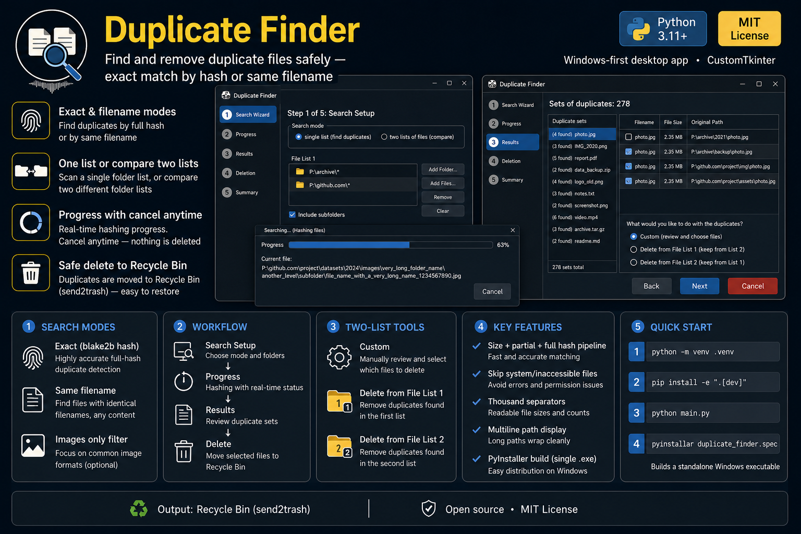

[](LICENSE)
[](https://github.com/denis-peshkov/duplicate-finder/releases)
[](https://github.com/denis-peshkov/duplicate-finder/issues)
[](https://github.com/denis-peshkov/duplicate-finder/actions/workflows/ci.yml)


[](https://github.com/denis-peshkov/duplicate-finder/contributors)
[](https://github.com/denis-peshkov/duplicate-finder/commits/master)


Homebrew will only accept this project into [homebrew-core](https://github.com/Homebrew/homebrew-core) once the GitHub repo is “notable” enough: roughly **≥225**  **Star**, **≥90**  **Fork**, and **≥90**  **Watch**. If you find Duplicate Finder useful, use the buttons at the top of this page — thank you.

# Duplicate Finder

<p align="center">
  
</p>

Desktop application for finding and removing duplicate files.

**CI/CD:** [pipeline diagram](docs/ci-cd.md) · [distribution](docs/distribution.md)

## Features

- Find duplicates within one list of paths, or compare two lists
- Modes: exact duplicate (hash) and same filename
- Images-only filter
- Optional subfolder traversal per list
- Cancellable scan progress
- Move selected files to the Recycle Bin

## Requirements

- Python 3.12+
- Windows (primary), macOS supported; code is cross-platform

## Install

### Chocolatey (Windows)

```powershell
choco install duplicate-finder
```

Adds `duplicate-finder` to PATH.

### Homebrew (macOS)

Stable (after the formula is accepted into homebrew-core):

```bash
brew install duplicate-finder
```

Preview (`release/*` / `hotfix/*`):

```bash
brew tap denis-peshkov/duplicate-finder https://github.com/denis-peshkov/duplicate-finder --branch homebrew-preview-tap
brew install duplicate-finder-preview
```

### GitHub Releases

Download binaries from [Releases](https://github.com/denis-peshkov/duplicate-finder/releases):

| Asset | Platform |
|-------|----------|
| `duplicate-finder-{version}-x86_64-pc-windows-msvc.zip` | Windows x64 (`DuplicateFinder.exe`) |
| `duplicate-finder-{version}-aarch64-apple-darwin.tar.gz` | macOS Apple Silicon |
| `duplicate-finder-{version}-x86_64-apple-darwin.tar.gz` | macOS Intel |
| `duplicate-finder-{version}-src.tar.gz` | Source archive |
| `SHA256SUMS` | Checksums |

### From source

```bash
cd duplicate-finder
python3.12 -m venv .venv
source .venv/bin/activate   # Windows: .venv\Scripts\activate
pip install -e ".[dev]"
```

On macOS you also need Tk: `brew install python-tk@3.12`.

## Run

```bash
python main.py
```

## Tests

```bash
pytest
```

## Build (PyInstaller)

```bash
pip install pyinstaller
pyinstaller duplicate_finder.spec
```

- Windows: `dist/DuplicateFinder.exe`
- macOS: `dist/DuplicateFinder`

## Versioning

[GitVersion](https://gitversion.net/) (`GitVersion.yml`) on push:

| Branch | SemVer (example) | Git tags | GitHub Release | Chocolatey | Homebrew |
|--------|------------------|----------|----------------|------------|----------|
| `master` | `0.1.5` (stable) | `v0.1.5`, `v0.1`, `v0` | **Release** (binaries + source) | push (stable) | core PR / bump |
| `release/*`, `hotfix/*` | `0.2.0-preview.3` | — | — | push (prerelease) | preview tap (`homebrew-preview-tap`) |

Preview branches publish Chocolatey and the Homebrew preview tap (no git tags). **Git tags** and **GitHub Release** run on **`master` only**. Details: [docs/ci-cd.md](docs/ci-cd.md).

On release binary builds, CI substitutes `version` in `pyproject.toml` and `APP_VERSION` in `src/config/app_info.py` before PyInstaller.

## Settings

- Config: `%USERPROFILE%\.duplicate-finder\settings.toml` (Windows) / `~/.duplicate-finder/settings.toml` (macOS)
- Log: `…/duplicate-finder.log`

## Development

### Repository layout

| Path | Role |
|------|------|
| `main.py` | Entry point (`--version` / GUI) |
| `src/` | Application code (`config`, `core`, `ui`, `utils`) |
| `tests/` | pytest |
| `duplicate_finder.spec` | PyInstaller spec |
| `GitVersion.yml` | SemVer for CI |
| `distribution/chocolatey/` | Chocolatey package template |
| `distribution/homebrew-core/` | homebrew-core formula draft |
| `distribution/homebrew-preview/` | Preview tap formula + README |
| `.github/workflows/ci.yml` | CI orchestrator — [docs/ci-cd.md](docs/ci-cd.md) |
| `.github/actions/` | Composite actions (version, test, build, publish-*) |
| `.github/scripts/` | Pack / Chocolatey / Homebrew helpers |
| `docs/` | [ci-cd.md](docs/ci-cd.md), [distribution.md](docs/distribution.md) |
| `duplicate-finder-icon.png` | Project / Chocolatey icon |
| `LICENSE` | MIT |

### Local CLI after install

```bash
duplicate-finder --version
```

## License

MIT — see [LICENSE](LICENSE).
