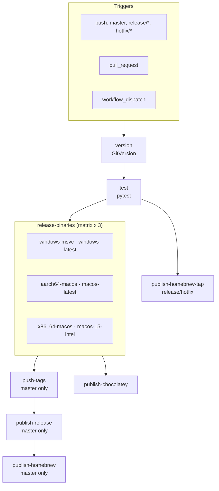

# CI/CD

Orchestrator: [`.github/workflows/ci.yml`](../.github/workflows/ci.yml)

Triggers: **push** (`master`, `release/*`, `hotfix/*`), **pull_request**, **workflow_dispatch**.

---

## Mermaid

---

## Jobs

| Job | Runner | When | Role |
|-----|--------|------|------|
| `version` | ubuntu-latest | always | GitVersion → `version`, `channel`, `prerelease` |
| `test` | ubuntu-latest | after version | `pytest` |
| `release-binaries` | matrix Win/macOS | after test | PyInstaller; upload `release-binary-*` on push to release branches |
| `push-tags` | ubuntu-22.04 | push `master` | tags `v{version}`, `v{X.Y}`, `v{X}` |
| `publish-chocolatey` | windows-latest | push master/release/hotfix | pack + push `.nupkg` |
| `publish-homebrew-tap` | ubuntu-22.04 | push release/hotfix | branch `homebrew-preview-tap` |
| `publish-release` | ubuntu-22.04 | push `master` | GitHub Release + checksums |
| `publish-homebrew` | macos-latest | after release on `master` | homebrew-core PR / bump |

On release builds (`publish_artifacts=true`), CI patches `pyproject.toml` and `APP_VERSION` in `src/config/app_info.py` before PyInstaller.

---

## Secrets

| Secret | Used by |
|--------|---------|
| `TAGTOKEN` | `push-tags`, Homebrew fork / preview tap |
| `CHOCOLATEY_API_KEY` | `publish-chocolatey` |
| `HOMEBREW_GITHUB_API_KEY` | `publish-homebrew` (`brew bump-formula-pr` / PR) |

Pipeline distribution details: [distribution.md](distribution.md).
